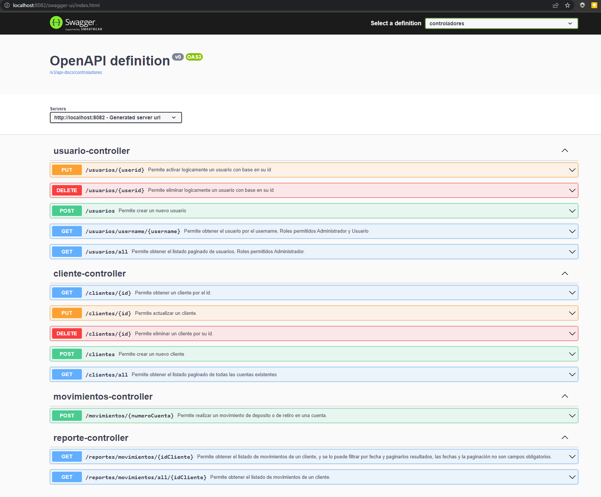
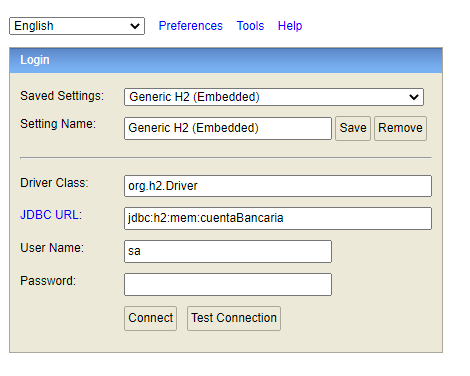
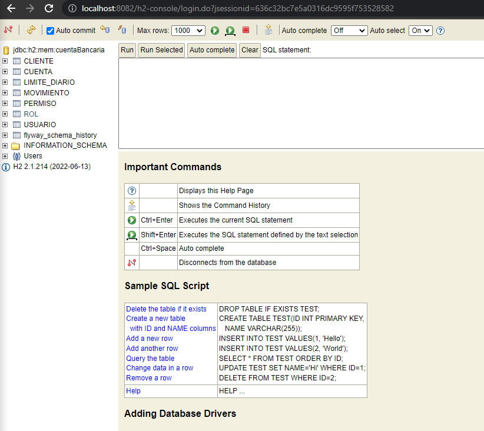
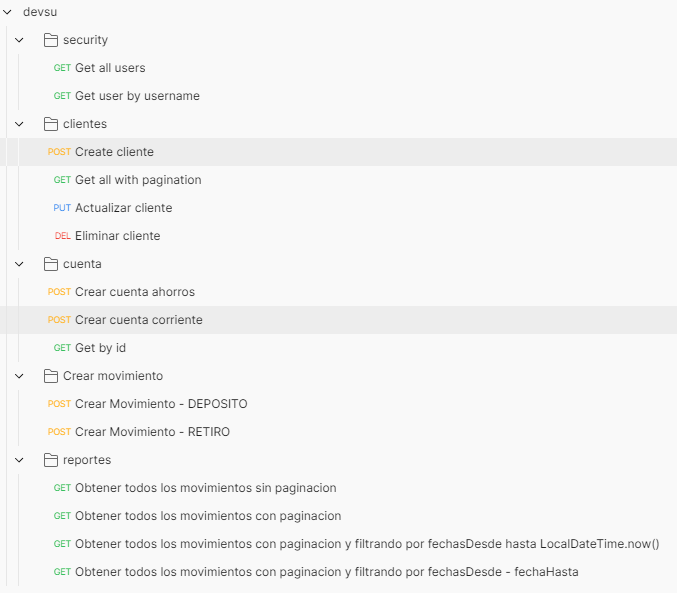

# Aplicación
- La aplicación tiene configurada como base de datos a H2, por lo que basta con inicializar el app para que se cree 
  la base de datos.
- Para la creación de tablas en la base de datos se está utilizando flyway, cada vez que la aplicación se inicialice 
  la base de datos se creará desde cero. 
- Se está utilizando autenticación básica con spring security y autorización a través de roles.  Los usuarios y 
  roles se crean automáticamente cuando la aplicación se inicializa. 
- Para limpiar el limite diario de cada cuenta, se ejecuta un proceso todos los días a las 12 de la noche que 
  elimina los datos de la tabla limite_diario, para que a día siguiente se reinicie el contador de cupo disponible 
  por día para retirar el dinero.

# Compilación del código

- Se debe importar el código en un IDE que soporte spring boot, ya sea IntelliJ o SpringToolSuit
- En una consola se debe ejecutar el comando
```bash
gradle build
```
- Se debe abrir el archivo DevsuCuentaBancariaApplication.java 
- Se debe hacer clic derecho en la clase con el método main y selecciona la opción "Run 'DevsuCuentaBancariaApplication.
  main()'" para compilar y ejecutar la aplicación.
- Si la aplicación se inicia correctamente, se deberá ver un mensaje en la consola indicando: Started DevsuCuentaBancariaApplication in 6.451 seconds (JVM running for 7.972)

# Probar la aplicación
## Documentación
- La documentación de la aplicación se encuentra en la siguiente url  http://localhost:8082/swagger-ui/index.html


- Para ver la base de datos se puede acceder a la siguiente url http://localhost:8082/h2-console/login.do, no existe 
  contraseña para acceder a la base de datos.



- El archivo con la colección de request de postman se encuentra en la carpeta docs/devsu.postman_collection.json, 
  en cada request ya está configurada la autenticación hacia el app.  se debe usar el usuario y contraseña admin/admin,
  la colección de postman contiene las siguientes endpoints:
